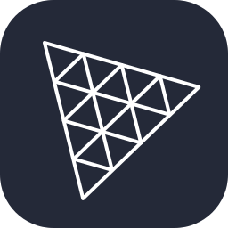
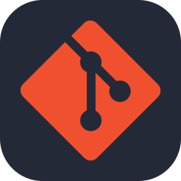
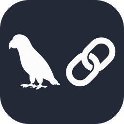
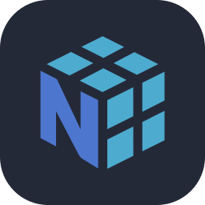

<!-- ============================================================ -->
<!--                            HEADER                            -->
<!-- ============================================================ -->
<div align="center">

# Zhidong Lei

#### AI Application Developer · Agent Builder · CS @ TYUT

<a href="https://git.io/typing-svg">
  
</a>

<br />

[](https://leizhidong.cn)
[](mailto:3290659791@qq.com)
[](https://github.com/Leizhidong-creator)

</div>

---

<div align="center">

### 🚀 _“让 AI 释放人的创造力，并把想法变成真正有价值的产品。”_

<sub>Building AI that empowers creativity and turns ideas into meaningful products.</sub>

</div>

<table>
<tr>
<td width="60%" valign="top">

## 👋 Who I Am

我是 **雷智栋（Zhidong Lei）**，一名热衷于 **AI 应用开发与 AI Agent 构建**的创造者。

我希望让 AI 不只展示能力，更能释放人的创造力、提升效率，并真正解决现实问题。怀着热情与好奇心，我正在把一个个想法转化为有用、可靠且有温度的 AI 产品。

当前专注于 **AI 应用产品落地**，并持续探索 **Agent 在企业流程与生产线中的提效方式**。

</td>
<td width="40%" valign="top">

## ⚡ At a Glance

```yaml
name: Zhidong Lei
role: AI Application Developer
school: 太原理工大学
major: 2025级计算机科学与技术专业
class: 卓越工程师班
program: TYUT 计算菁英计划
member: TYUT 工程训练中心
base: 国家级教学实验基地
focus: AI Products · Enterprise Agents
location: Taiyuan, Shanxi, China
```

</td>
</tr>
</table>

---

## 🔭 Currently Building & Learning

<table>
<tr>
<td width="50%" valign="top">

### 🛠️ Building

- 将 **AI 应用原型**推进为可部署、可交付的真实产品
- 探索 **Agent** 在企业工作流与生产线中的提效路径
- 构建可靠、可解释、可验证的 AI 决策工作流

</td>
<td width="50%" valign="top">

### 🌱 Learning & Exploring

- **Agent Orchestration** 与复杂工具调用
- **Context Engineering** 与 RAG 系统设计
- AI 服务可靠性、评测与降级机制
- 企业内网部署与端到端工程交付

</td>
</tr>
</table>

---

## 🧰 Tech Stack

<div align="center">
  
  &nbsp;&nbsp;
  
  &nbsp;&nbsp;
  
  &nbsp;&nbsp;
  
</div>

<br />

<table align="center">
<tr>
<td align="right" width="190"><b>🧠 Languages & Core</b></td>
<td>
  
  
  
  
  
  
</td>
</tr>
<tr>
<td align="right"><b>🤖 AI & Backend</b></td>
<td>
  
  
  
</td>
</tr>
<tr>
<td align="right"><b>🎨 Frontend & Creative</b></td>
<td>
  
  
  
  
  
  
  
  
</td>
</tr>
<tr>
<td align="right"><b>📦 Data & Delivery</b></td>
<td>
  
  
  
  
  
  
</td>
</tr>
</table>

---

## 🏆 Selected Work & Achievements

| 🔗 Repository | 🏅 Achievement | 🛠️ My Contribution |
|:---|:---:|:---|
| **[AI-Meeting-Room-System](https://github.com/Leizhidong-creator/AI-Meeting-Room-System)** | `15w+` 纯软件方案报价 | **项目 Owner**：主导语音处理链路、AI 工作流可靠性，以及采集端、Go 业务服务、FastAPI AI 服务与企业内网环境的整体交付。 |
| **[Multi-Agent-Disaster-Simulation](https://github.com/Leizhidong-creator/Multi-Agent-Disaster-Simulation)** | 中国机器人及人工智能大赛<br>**国家级奖项** | **项目负责人**：主导快慢双脑架构、多智能体仿真、RAG 风险诊断、可视化工作区与干预复演闭环。 |
| **Repository coming soon**<br><sub>口袋参谋 · 餐饮经营决策 Agent</sub> | 抖音 AI 创变者黑客松<br>武汉大区赛优秀作品 · **Top 10** | **核心开发者**：主导决策架构、四级证据链、实时视频专家连麦，以及 H5、FastAPI、知识库和工具服务的端到端联调。 |
| **[Classical-Gardens-of-Suzhou](https://github.com/Leizhidong-creator/Classical-Gardens-of-Suzhou)** | 山西赛区一等奖<br>**游园会之星** | **核心开发者**：负责 AI 生成式 3D 资产适配、2D/3D 混合渲染、空间交互、页面动效与复杂场景性能链路。 |

---

## 📌 Featured Projects

<div align="center">

[](https://github.com/Leizhidong-creator/AI-Meeting-Room-System)
[](https://github.com/Leizhidong-creator/Multi-Agent-Disaster-Simulation)
[](https://github.com/Leizhidong-creator/Classical-Gardens-of-Suzhou)

**口袋参谋 · Repository coming soon**

<sub>项目成果与个人贡献见上方表格；仓库发布后加入第四张同款仓库卡。</sub>

</div>

---

## 📊 GitHub Activity

<div align="center">


<br />


</div>

---

## 🐍 Contribution Journey

<div align="center">

<picture>
  <source media="(prefers-color-scheme: dark)" srcset="https://raw.githubusercontent.com/Leizhidong-creator/Leizhidong-creator/output/github-contribution-grid-snake-dark.svg" />
  <source media="(prefers-color-scheme: light)" srcset="https://raw.githubusercontent.com/Leizhidong-creator/Leizhidong-creator/output/github-contribution-grid-snake.svg" />
  
</picture>

</div>

---

<div align="center">

## 一起创造有价值的 AI

如果你也在构思一个真正有用的 AI 产品，或者正在探索 Agent 在企业与生产场景中的落地，欢迎交流。

**Have an idea for a useful AI product? Let's talk.**

[Portfolio](https://leizhidong.cn) · [Email](mailto:3290659791@qq.com) · [GitHub](https://github.com/Leizhidong-creator)

<br />

<sub>Made with curiosity, creativity, and a commitment to useful AI.</sub>

</div>
