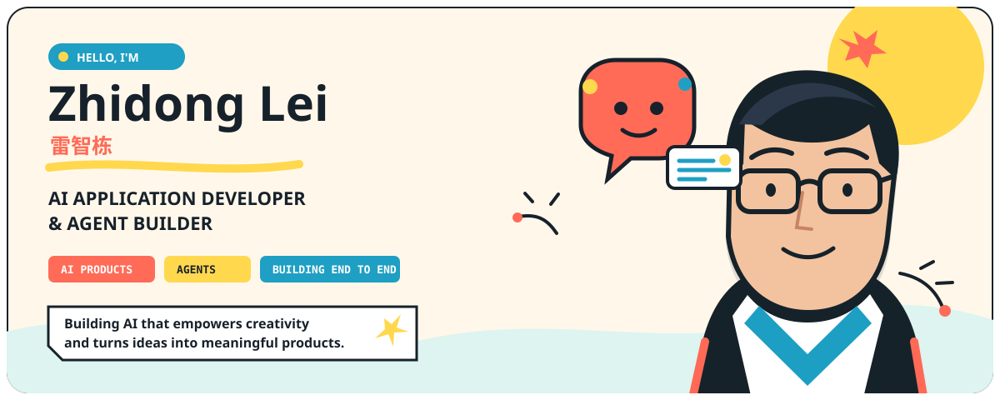
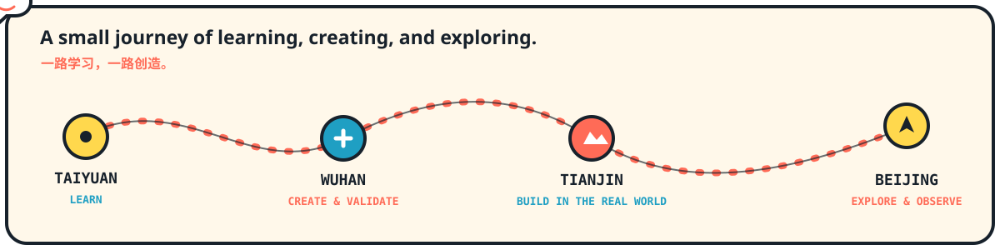
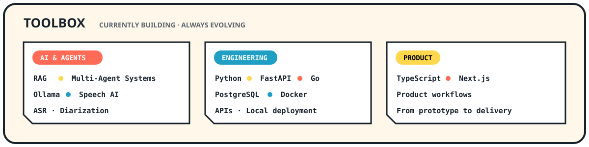
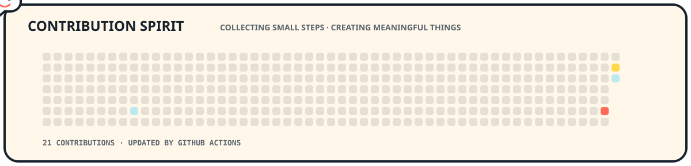

 

<a href="mailto:3290659791@qq.com"><strong>Email</strong></a>
&nbsp;&nbsp;·&nbsp;&nbsp;
<a href="https://github.com/Leizhidong-creator"><strong>GitHub</strong></a>

## 关于我

我是 **雷智栋（Zhidong Lei）**，一名热衷于 **AI 应用开发与 AI Agent 构建**的创造者。

- 🎓 太原理工大学 2025 级计算机科学与技术专业 · 卓越工程师班
- ✨ 入选 **TYUT 计算菁英计划**
- 🧪 太原理工大学工程训练中心成员（国家级教学实验基地）
- 🤝 期待 AI 项目合作与技术交流

我希望让 AI 不只展示能力，更能释放人的创造力、提升效率，并真正解决现实问题。怀着热情与好奇心，我正在把一个个想法转化为有用、可靠且有温度的 AI 产品。

> **让 AI 释放人的创造力，并把想法变成真正有价值的产品。**
>
> Building AI that empowers creativity and turns ideas into meaningful products.

## Journey

## Toolbox

## Contribution Spirit

## 一起创造有价值的 AI

如果你也在构思一个真正有用的 AI 产品，或者想交流 AI Agent、RAG、多智能体与端到端 AI 应用开发，欢迎联系我。

**Have an idea for a useful AI product? Let's talk.**

📮 **3290659791@qq.com**

Made with curiosity, creativity, and a small data spirit.

